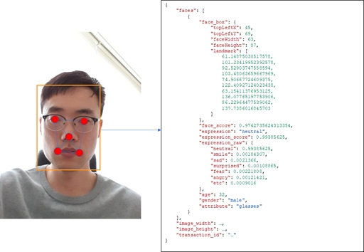
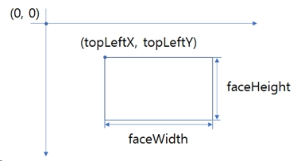

# Overview

NUGU facecan API는 크게 얼굴검출/얼굴인식 기능을 제공합니다. 얼굴 검출/인식 기능은 모두 이미지(JPEG)를 입력으로 사용하는데, 얼굴 검출 기능은 이미지에서 얼굴로 판단되는 모든 영역에 대해 위치/신뢰도/표정/성별 등을 출력으로 전달합니다. 또한, 얼굴 인식 기능은 이미지에서 찾아낸 얼굴 가운데, 중앙에 가장 가까운 얼굴이 데이터 베이스 상의 어떤 얼굴인지를 사용자에게 출력합니다. 이때, 사용자가 사전에 구축한 DB 데이터를 검색하여 결과를 도출하기 때문에, 반드시 사전에 사용자가 얼굴의 등록을 진행하여 사용자 별로 DB를 구축해야 사용할 수 있습니다.

 
 

> ## 얼굴 검출 기능 

얼굴 검출 기능은 사진에서 얼굴 정보를 찾아내어 그 위치와 그 때의 특징점들, 그리고 인식 대상의 신뢰도, 표정, 성별 등을 출력으로 전달합니다. 아래의 [Fig. 1](#fig_1) 은 해당 내용을 이미지에 덧씌워 표현한 것으로 landmark는 검출 결과를 대표하는 5개의 점이 출력으로 받을 수 있습니다.

 

<a name="fig_1">Fig. 1</a> 얼굴 검출 결과 예시

 

face_box 값은 topLeftX, topLeftY, faceWidth, faceHeight 값과 landmark 값으로 표현하는데, 각각의 값의 의미는 아래의 [Fig. 2](#fig_2) 와 같습니다.

 

<a name="fig_2">Fig. 2</a> face_box 좌표계

Landmark는 얼굴 특징을 분류하기 위해 사용된 5개의 점을 의미하고, face_score는 검출된 내용이 얼굴일 수 있는 확률을 나타냅니다. Expression 은 검출된 얼굴의 감정 상태를 의미하는데, neutral, smile, sad, suprised, fear, angry 외 etc(기타)로 분류된 감정 상태 중 가장 높은 값을 리턴하게 됩니다. 각각의 확률은 expression_raw에 나타나 있기 때문에, 해당 값을 활용하여 다른 형태로 값을 사용할 수 있습니다. 또한, age/gender 도 나타내며 부가적인 정보로 attribute를 출력합니다. 그리고 attribute 에는 normal, glasses, sunglasses, mask, occlusion, blur, not-face, profile-face 가 있고 각각의 의미는 하기 [Table. 1](#table_1) 과 같습니다.

 

<a name="table_1">Table. 1</a> Attribute 세부 속성 및 의미
|속성|의미|
|----|----|
|Normal|보통 상태|
|Glasses|안경 착용|
|Sunglasses|선글라스 착용|
|Mask|마스크 착용|
|Occlusion|이미지 일부에 가림이 있음. 보통 손이나 핸드폰으로 얼굴을 가렸을 경우 해당|
|Blur|블러한 이미지|
|Not-face|얼굴 이미지가 아님. face_score 가 현저히 낮은 경우 주로 발생|
|Profile-face|옆 얼굴|

 
 

> ## 얼굴인식 기능

얼굴인식 기능은 이미지를 분석하여, 사전에 구축된 Database 로부터 비교/대조하여 해당 사진에 있는 얼굴이 누구인지를 결과를 사용자에게 전달합니다. 그러므로 인식 기능을 사용하기 위해서는 사전에 얼굴 인식의 대상자의 데이터를 구축해놓는 과정이 필요합니다. 이는 REST API를 활용하여 간단하게 구축할 수 있고, 아래와 같은 형태의 Group/Subject/Face 형태의 구조를 활용하여 사전 Database를 구축하는 과정으로 시작합니다. ([Fig. 3](#fig_3))

 

<a name="fig_3">Fig. 3</a> Group/Subject/Face

 

[Fig. 3](#fig_3)과 같이 얼굴인식 기능의 Database 는 Group>Subject>Face 순의 카테고리 구조를 가지고 있습니다. Face는 얼굴데이터 1개를 의미하고, 하나의 Subject는 다수의 Face를 포함할 수 있습니다. Subject는 특정인을 의미하고, 다수의 얼굴 사진을 포괄하는 의미를 가지고 있습니다. 얼굴인식API의 출력 데이터는 Subject의 id/name을 반환하며, 이를 활용하여 입력으로 제공한 사진 데이터가 누구의 것인지 식별하는 형태로 사용합니다. 

Group 은 이를 포괄하는 더 큰 개념으로서 부서/장소/회사 등 더 큰 단위로 사용합니다. Subject를 임의의 그룹화하기 위한 단위로서, 주로 장소 단위로 사용합니다. Group의 id를 얼굴 인식을 요청할 때 함께 입력하도록 구성되어 있는데, 이는 해당 얼굴 데이터를 검색할 때 해당 Group 내의 Subject 값을 검색하기 때문입니다. 이와 같이 Group 별로 값을 격리함으로써, 특정 장소나 특정 위치에서는 특정 대상자만 얼굴인식이 되도록 사용할 수 있습니다. 

위와 같은 Group/Subject/Face DB를 구축하고 나면 얼굴인식 기능을 활용하여, 특정 이미지에서의 얼굴이 누구인지 식별할 수 있습니다. 얼굴인식 API의 출력은 아래의 [Table. 2](#table_2) 와 같습니다.

 

<a name="table_2">Table. 2</a> 얼굴인식기능의 출력과 의미

|속성|의미|
|---|---|
|Subject_id|검색된 해당 얼굴이 속한 Subject의 id|
|Subject_name|DB에 저장되어 있는 Subject의 이름(Group내의 Subject_name은 유니크해야 함)|
|Distance|DB에 저장된 얼굴 중 가장 가까운 얼굴과의 유사도(0~1 범위, 0일수록 닮음)|
|Face_id|DB에 저장된 얼굴 중 가장 가까운 face 의 id|
|Face_score|입력된 사진의 얼굴 데이터의 신뢰도|  

(*) face_box, expression, expression_score, expression_raw, age, gender 등 나머지 데이터는 얼굴 검출과 동일한 결과를 가짐

 

보다 자세한 API 관련 사양은 [NUGU facecan API Document](https://openapi.sk.com/resource/apidoc/indexView) 을 참고하시기 바랍니다.

