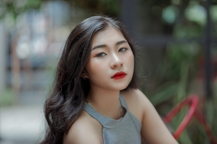
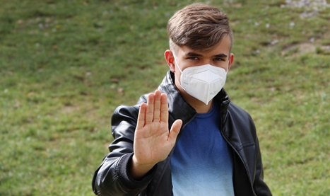
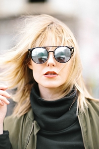
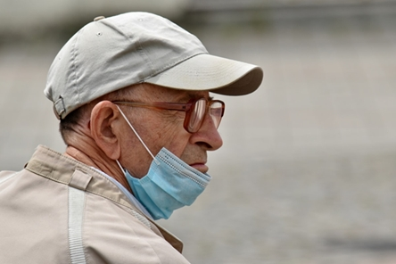
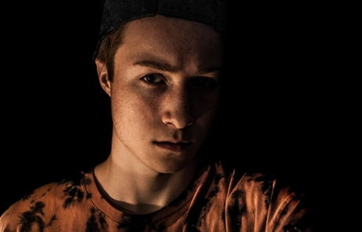
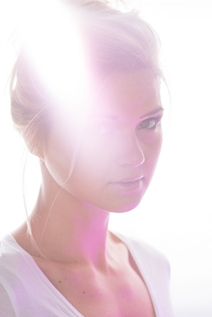
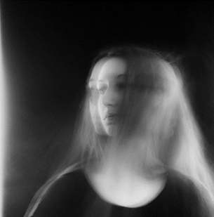
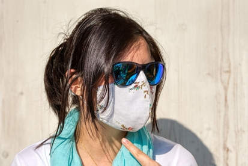

# Requirements

얼굴인식 기능은 다음과 같은 사양을 지원합니다.

- 지원 해상도: 320x240 ~ 3840x2160   

- 권장 해상도: 640x480 ~ 1920x1080   

- 지원 이미지: 2 MB 크기 이하의 JPG, JPEG 포멧의 이미지 파일(비디오 파일은 지원되지 않습니다.)   

- 이미지 요구사항  
  - 컬러 영상을 입력으로 사용해야 함  
  - 모션에 의한 블러가 없이 선명해야하고, 얼굴을 가리는 부분이 없어야함  
  - 조명이 너무 밝거나 어둡지 않아야함    
 
  
- 인식을 위한 얼굴 요구 사항   
  - 얼굴 크기는 80x80 이상을 권장  
  - 좌/우 각도는 30도 이내, 상/하 각도는 15도 이내  
  - 이미지 내에 정면을 향하고 있어야함  
  - 눈은 두 눈을 다 떠야하며, 한쪽 눈을 감거나, 두 눈을 다 감으면 성능이 저하될 수 있음  
  - 마스크 착용 시 눈썹이 가려지면 성능이 저하될 수 있음 

 
 

# Samples

> ## 얼굴인식이 가능한 경우

 

얼굴 이미지가 선명하고, 이미지 내에서의 크기가 적당히 크고, 얼굴이 정면을 향하고 있음

 

마스크를 착용하더라도 얼굴이 선명하고, 정면, 눈/눈썹이 잘 보이면 인식이 가능

 
 

> ## 얼굴인식이 어려운 경우

 

선글라스를 착용해도 인식은 가능하지만, 성능은 저하될 수 있음  

마스크와 선글라스 동시 착용 시 성능이 보장되지 않음

 

정면으로 카메라를 응시하지 않고, 상/하/좌/우 방향으로 얼굴의 각도를 돌린 경우

 

조명이 더두워 얼굴 부위가 검게 나오거나 사람이 식별하기 어려운 경우

 

조명이 너무 밝아 얼굴의 일부 정보가 소실된 경우

 

블러가 발생하여, 얼굴이 선명하게 촬영되지 않은 경우

 

선글라스/마스크를 동시에 착용하는 경우

