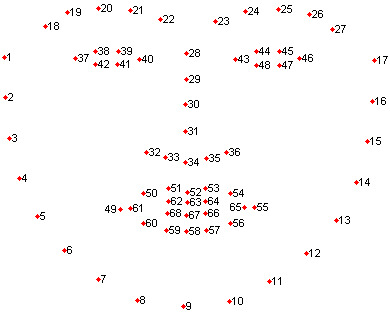

# Tutorial

 간단하게 알아본 얼굴인식 서비스의 실제 사용을 위해 SK OpenAPI를 사용하여 어떻게 연동할 수 있는지 알아보겠습니다. 간단한 가정을 하고, 거기에 맞는 DB를 구축하고 그에 따른 사용 방법을 실습합니다. 간단한 가정과 실습에는 Postman과 같은 REST API 접근을 위한 도구를 활용하거나, curl 명령을 이용하도록 합니다. 여기서는 curl 명령을 이용하여 진행합니다. 

먼저, 다음과 같은 환경을 가정합니다. A 라는 회사의 1층/2층에 각각 얼굴인식을 위한 시스템을 구성하고자 합니다. 1/2층 각각 서로 다른 구성원이 근무하고 있으며, 1층에는 A, B 사원, 2층에는 C, D 사원이 있다. 이런 경우에 어떤 식으로 얼굴인식을 위한 DB 구축을 할지 하나씩 살펴봅니다.

본 문서에서 다루는 내용은 얼굴인식API 구조에 대한 이해와 사용을 위한 것이고, 그 외의 내용은 다루지 않습니다. 실제 서비스 구축에는 얼굴의 촬영을 위한 App 개발이나 Device 연동 등이 필요합니다. 

 
 

> ## SK OpenAPI Key

우선 SK OpenAPI에 가입하고, 얼굴인식 서비스의 사용 신청을 하면 Key 메뉴에서 다음의 [Fig 1.](#fig_1) 과 같이 Project Key(App Key) 와 Access Key Name에 해당하는 app-id 라는 이름과 Access Key Value 값을 얻을 수 있습니다. 이 두 값은 해당 API를 사용하는 데 있어서 필수적인 값이며, 신청할때 임의로 생성되어 제공 됩니다. 앞으로 이 계정을 사용하여 테스트하기 위해 지속적으로 사용되는 값이니 따로 기록해둡니다.

 

- appKey : l7xx4bfa60c6bc8945819a114c5e34cc930c  
- app-id : GZ0E4G4YI1

 

<a name="fig_1">Fig. 1</a> appKey, app-id 

 
 

> ## Group 생성 및 확인

 
1/2층 각각 다른 구성원이 근무하고, 1층은 A, B 사원, 2층은 C, D 사원이 있기 때문에, Group/Subject 은 다음과 같이 구성합니다.  

 

Group 1층 - Subject A, B  
Group 2층 - Subject C, D 

 

우선 가장 큰 카테고리인 Group을 만들고, 제대로 만들어졌는지 확인하고 난 후, Subject을 하나씩 추가하도록 합니다. 그리고 난 후, A, B, C, D에 맞는 각각의 얼굴 사진을 추가한 이후에 정상적으로 기능이 동작하는지 확인하도록 합니다.  
먼저 1층 Group을 만들도록 합니다. 이름은 한글을 사용할 수 없으므로 1st-floor 로 지정하여 만들도록 합니다.

 

|Category|Contents|
|---|---|
|Request| curl --location   --request POST 'https://apis.openapi.sk.com/nugufacecan/v1/group'   --header 'appKey: l7xx4bfa60c6bc8945819a114c5e34cc930c'   --header 'app-id: GZ0E4G4YI1'   --header 'group-name: 1st-floor'   |
|Response| 200 OK  <pre>{   “group_id”: “80NOKFZPAL”,   “group_name”: “1st-floor”,   “transaction_id”: “F00003858A8P”  }</pre>  |

- (주의) 여기서 group_id, transaction_id 는 임의 생성되므로 예시와 값이 다름

 

이와 같이 api/face/group에 POST 형태로 헤더를 appKey, app-id, 그리고 생성할 그룹의 이름인 group-name을 추가하여 실행하면, 정상적으로 생성이 되었으며 200 OK 와 함께, group-name에 맞는 group-id를 Response 로 받을 수 있습니다. 이를 활용하여, Subject A, B를 추가할때는 group-id를 헤더에 추가하여 Group 1층에 사람을 추가할 수 있습니다.  
정상적으로 Group 이 추가되었는지 확인은 다음과 같이 동일 URL에 GET 형태로 appKey, app-id 만을 헤더로 추가하여 수행하면 됩니다. 해당 명령을 수행하면, 추가된 모든 Group 정보를 확인할 수 있습니다.

 

|Category|Contents|
|---|---|
|Request| curl --location  <ensp> --request GET 'https://apis.openapi.sk.com/nugufacecan/v1/group'  <ensp> --header 'appKey: l7xx4bfa60c6bc8945819a114c5e34cc930c'  <ensp> --header 'app-id: GZ0E4G4YI1' |
|Response| 200 OK <pre>{   {     “group_id”: “80NOKFZPAL”,     “group_name”:“1st-floor”,   } }</pre> |
    
 
정상적으로 추가된 것을 확인하면 이어서, 2층 Group을 추가하도록 합니다.   

 

|Category|Contents|
|---|---|
|Request| curl --location   --request POST 'https://apis.openapi.sk.com/nugufacecan/v1/group'   --header 'appKey: l7xx4bfa60c6bc8945819a114c5e34cc930c'   --header 'app-id: GZ0E4G4YI1'   --header 'group-name: 2nd-floor'   |
|Response| 200 OK  <pre>{   “group_id”: "RQFW3CNS3V",   “group_name”: “2nd-floor”,   “transaction_id”: "H00003858A9I"  }</pre>  |

 

마찬가지로 다시 GET을 통하여 정상적으로 Group 2개가 추가되었는지 확인합니다. 만약 정상적으로 추가되었다면 다음과 같은 결과를 확인할 수 있습니다.

 

|Category|Contents|
|---|---|
|Request| curl --location  <ensp> --request GET 'https://apis.openapi.sk.com/nugufacecan/v1/group'  <ensp> --header 'appKey: l7xx4bfa60c6bc8945819a114c5e34cc930c'  <ensp> --header 'app-id: GZ0E4G4YI1' |
|Response| 200 OK <pre>{   {     “group_id”: “80NOKFZPAL”,     “group_name”:“1st-floor”,   },   {     "group_id": "RQFW3CNS3V",      "group_name": "2nd-floor"    }  }</pre> |

> ## Subject 생성 및 확인

 

이제 1층/2층 Group의 구성이 완료되었으니 이에 Subject 데이터를 추가하도록 합니다. 1층은 A, B, 2층은 C, D인데, 1층의 group_id는 “80NOKFZPAL” 이고, 2층은 “RQFW3CNS3V” 이므로 다음과 같이 Subject에 대한 추가를 진행합니다.

 

|Category|Contents|
|---|---|
|Request| curl --location  <ensp> --request POST 'https://apis.openapi.sk.com/nugufacecan/v1/subject'  <ensp> --header 'appKey: l7xx4bfa60c6bc8945819a114c5e34cc930c'  <ensp> --header 'app-id: GZ0E4G4YI1'  <ensp> --header 'group-id: 80NOKFZPAL'  <ensp>  --header 'subject-name: A'   |
|Response| 200 OK <pre>{   “subject_id”: “8YLHWXT0K0”,    "group_name”: “1st-floor”,   “subject_name”: “A”,    "transaction_id”: “D00003858AAB”  } </pre> |

정상적으로 추가가 완료되면, 위와 같이 subject_id 가 부여되고, 추가한 정보들도 같이 나열됩니다. 위와 A를 추가한 방식으로 나머지 B, C, D를 모두 추가하고, Group 과 마찬가지로 /api/open/face/subject에 GET으로 호출하면, 정상적으로 추가되었을 경우 아래와 같이 볼 수 있습니다.

|Category|Contents|
|---|---|
|Request| curl --location   --request GET 'https://apis.openapi.sk.com/nugufacecan/v1/subject'   --header 'appKey: l7xx4bfa60c6bc8945819a114c5e34cc930c'   --header 'app-id: GZ0E4G4YI1'   --header 'group-id: VOFLIDEYD6' |
|Response| 200 OK <pre>{   {     “subject_id”: “8YLHWXT0K0”,      "group_name”: “1st-floor”,     “subject_name”: “A”,   },    {     "subject_id": "M0N69EP2VJ",     "group_name": "1st-floor",      "subject_name": "B"    } } </pre> |

|Category|Contents|
|---|---|
|Request| curl --location   --request GET 'https://apis.openapi.sk.com/nugufacecan/v1/subject'   --header 'appKey: l7xx4bfa60c6bc8945819a114c5e34cc930c'   --header 'app-id: GZ0E4G4YI1'   --header 'group-id: 80NOKFZPAL'' |
|Response| 200 OK <pre>{   {     “subject_id”: “2GEMZVDYE4”,      "group_name”: “2nd-floor”,     “subject_name”: “C”,   },    {     "subject_id": "YN5V8SG213",     "group_name": "2nd-floor",      "subject_name": "D"    } } </pre> |

 

> ## Face 추가와 확인

 

Face 역시 마찬가지로 group-id, subject-id를 header 로 넣고, face_name을 추가로 지정해서 파라미터로 넣습니다. 그리고 해당 인물의 얼굴이 있는 사진을 첨부하여 넣는데, 이때, 한 사람의 여러 형태의 얼굴 데이터를 넣는 것이 인식률 향상에 도움이 될 수 있습니다. 아래의 코드와 같이 form 형태로 이미지 데이터를 넣으면 Response는 200 OK 외에 아무것도 나타나지 않으며, 정상적으로 처리가 됩니다.

 

|Category|Contents|
|---|---|
|Request| curl --location  --request POST 'https://apis.openapi.sk.com/nugufacecan/v1/face'  --header 'appKey: l7xx4bfa60c6bc8945819a114c5e34cc930c'   --header 'app-id: GZ0E4G4YI1'   --header 'group-id: VOFLIDEYD6'  --header 'subject-id: 8YLHWXT0K0   --header 'face-name: A_face'   --form 'image=@"A_face_1.jpg"' |
|Response| 200 OK |

 

Face 역시 Group/Subject 와 같이 GET 으로 호출하면, 얼굴 데이터가 정상적으로 추가 되었는지 확인할 수 있는데, 정상적으로 추가 된 경우 아래와 같은 형태로 Response 를 확인할 수 있습니다. 

 

|Category|Contents|
|---|---|
|Request| curl --location  --request GET 'https://apis.openapi.sk.com/nugufacecan/v1/face'  --header 'appKey: l7xx4bfa60c6bc8945819a114c5e34cc930c'  --header 'app-id: GZ0E4G4YI1'  --header 'group-id: VOFLIDEYD6'   --header 'subject-id: 8YLHWXT0K0' |
|Response| 200 OK <pre>[   {     "face_id": "AIF2SGCB9R",     "face_name": "A",     "box": {       "landmark": [         315.33056640625,         395.97271728515625,         509.1438293457031,         382.5447692871094,         402.6089172363281,         496.8799133300781,         341.49383544921875,         597.4930419921875,         504.7567138671875,         585.8673706054688       ],       "topLeftX": 215,       "topLeftY": 181,       "faceWidth": 436,       "faceHeight": 561     },     "face_score": 1.0,     "expression": "smile",     "expression_score": 0.932392954826355,     "age": 25,     "gender": "female",      "attribute": "normal",     "image_width": 900,     "image_height": 1350,     "engine_version": 390   },   {     "face_id": "IQA498UJYO",     "face_name": "A",     "box": {       "landmark": [          315.33056640625,         395.97271728515625,         509.1438293457031,         382.5447692871094,         402.6089172363281,         496.8799133300781,         341.49383544921875,         597.4930419921875,         504.7567138671875,         585.8673706054688       ],       "topLeftX": 215,       "topLeftY": 181,       "faceWidth": 436,       "faceHeight": 561     },     "face_score": 1.0,     "expression": "smile",     "expression_score": 0.932392954826355,      "age": 25,     "gender": "female",      "attribute": "normal",     "image_width": 900,      "image_height": 1350,      "engine_version": 390    } ] |

 

여기까지 A, B, C D 에 대한 모든 데이터를 등록하면, API 를 사용할 준비가 완료되었습니다. 이제 Recognize API 를 사용하여 실제 얼굴인식을 사용해볼 수 있습니다.

 

> ## 얼굴인식 기능의 사용

 

얼굴인식 API는 사용자가 전달한 이미지를 분석해서 해당 이미지에서 얼굴정보와 특징을 추출하고, 기존에 구축한 DB에서 가장 유사한 얼굴 데이터를 찾아 사용자에게 식별 정보를 반환하는 방식으로 동작합니다. 위의 내용을 모두 진행 했으면 Group/Subject/Face 데이터를 사전에 구축했기 때문에, 이제 얼굴인식 API를 사용하여 식별을 요청할 수 있습니다. 실제 API에서 요청을 진행하면 다음과 같은 방식으로 요청을 처리하게 됩니다([Fig 2.](#fig_2)).

 

<a name="fig_2">Fig. 2</a> Face Recognition Processing

 

API 의 요청 명령과 결과는 다음과 같이 확인할 수 있습니다.

|Category|Contents|
|---|---|
|Request| curl --location   --request POST 'https://apis.openapi.sk.com/nugufacecan/v1/recognize'   --header 'appKey: l7xx4bfa60c6bc8945819a114c5e34cc930c'   --header 'app-id: GZ0E4G4YI1'   --header 'group-id: VOFLIDEYD6'   --form 'image=@"A_Face_3.jpg"' |
|Response| 200 OK <pre>{   "subject_id": "8YLHWXT0K0",   "subject_name": "A",   "distance": 0.19108226147411367,   "face_box": {     "topLeftX": 148,     "topLeftY": 84,     "faceWidth": 205,     "faceHeight": 281,     "landmark": [       222.57568359375,       197.8626708984375,       316.3310546875,       191.84608459472656,       285.20001220703125,       246.61094665527344,       235.28875732421875,       297.4136657714844,       311.33209228515625,       292.1959533691406     ]   },   "face_id": "AIF2SGCB9R",   "face_score": 1.0,   "expression": "smile",   "expression_score": 0.67128611,   "expression_raw": {     "neutral": 0.32691383,     "smile": 0.67128611,     "sad": 0.00118194,     "surprised": 0.00312898,     "fear": 0.00042589,     "angry": 0.0013624,     "etc": 0.00249748   },   "age": 27,   "gender": "female",   "attribute": "normal",   "transaction_id": "M00003858C4Q" } </pre>

여기서 사용자의 식별에 사용하는 용도라면, subject_id/name 이 가장 중요한 요소가 될 것이고, 그 외에 다른 정보들도 활용이 가능합니다. 예를 들면, face_score 가 1.0 이지만, 이보다 적은 수치가 나오면, 이는 현재 촬영한 영상 내에서 얼굴의 형태가 신뢰하기 어렵다는 의미이기 때문에, 재촬영을 요구할 수 있습니다. 또한, distance 값이 너무 크게 나온다면, 그 결과의 신뢰도가 떨어지는 의미 이기 때문에, 재촬영을 요구하거나 하는 등의 처리가 가능합니다.

그리고 부가적으로 한 사진에 여러 명의 얼굴이 있고, 여러 명을 동시에 찾는 것이 필요한 경우에는 header에 multi: 1 값을 추가하면, 한 번에 여러 개의 얼굴 결과를 동시에 출력하게 됩니다.

여기까지 사용자 DB를 만드는 과정과 얼굴인식을 수행하는 과정에 사용하는 API 와 개략적인 구조를 살펴보았습니다. curl 명령에 있는 POST/header/form 등은 어느 언어를 사용하든 동일한 인터페이스를 사용하기 때문에 이를 참조하여 진행하면 됩니다. 실제 서비스는 영상을 촬영하는 방식을 결정/구현해야 하고, 자료구조를 어떻게 결정하는 것이 활용에 편의성이 있을지 많은 검토가 필요합니다. 

 

> ## 얼굴검출 기능의 사용

 

위 내용에서 얼굴인식에 필요한 전체 과정을 살펴 보았습니다. 본 내용에서는 얼굴의 위치, 얼굴 점수, 나이, 성별, 표정, 속성 정보를 얻을 수 있는 얼굴검출 API 호출과 관련된 내용을 소개해 드립니다. 

얼굴인식의 경우 얼굴 등록 과정이 필요하였지만 얼굴검출은 이런 과정이 별도로 필요하지 않으며 인식 하려고 하는 이미지를 단순히 호출함으로써 원하는 정보를 얻을수 있습니다. 본 API를 통해서 얻을수 있는 정보는 얼굴의 위치, 얼굴 점수, 나이, 성별, 표정, 속성으로 해당 정보에 대한 상세 내용은 아래 표를 참고하시면 됩니다.

|항목|type|class/범위|설명|
|---|---|---|---|
|얼굴 위치(face_box)|int|좌표정보|영상내에서 얼굴이 위치한 x,y,w,h정보|
|얼굴 점수(face_score)|float|0~1|얼굴 위치에서 확인된 얼굴이 실제 얼굴인지 여부를 알려주는 값. 1에 가까울수록 얼굴일 확률이 높고 0에 가까울수록 얼굴이 아닐 확률이 높음|
|나이(age)|int|0~100|사진을 통해 유추한 나이 (apparent age)|
|성별(gender)|str|unknown, male, female|성별 정보로 남자는 male, 여자는 female, 성별 판단이 어려운 경우 unknown으로 전달, 아이의 경우 unknown으로 전달|
|표정(expression)|str|neutral, smile, sad, surprise, fear, angry, etc|인간의 기본적인 6가지 감정을 토대로 top-1 표정 결과를 전달|
|표정 점수(expression_score)|float|0~1|top-1 표정의 confidence 값, 1에 가까울수록 해당 표정일 확률이 높음|
|속성(attribute)|str|normal, glasses, sunglasses, mask, occlusion, blur, not-face, profile-face	|얼굴에 포함된 다양한 속성 정보 중 top-1 속성을 전달. normal은 얼굴인식하기에 적합한 얼굴 상황을 의미하고, glasses는 안경을 착용한 상황, sunglasses는 선글라스를 착용한 상황, mask는 마스크를 착용한 상황으로 인식한 것입니다. occlusion은 얼굴을 가리는 요소가 있는 상황, blur는 얼굴이 흐리게 촬영되어 선명하지 않은 상황, not-face는 검출한 얼굴 위치가 실제로 얼굴이 아닐수 있는 상황이며, profile-face는 얼굴의 옆모습이 촬영된 상황을 의미합니다.|
|속성 점수(attribute_score)|float|0~1|top-1 속성의 confidence 값, 1에 가까울수록 해당 속성일 확률이 높음|

얼굴검출 API 의 요청 명령과 결과는 다음과 같이 확인할 수 있습니다. 헤더에는 인증을 위한 appKey와 app-id 만을 필요로 하며 group-id는 정보는 필요하지 않습니다.

|Category|Contents|
|---|---|
|Request| curl --location   --request POST 'https://apis.openapi.sk.com/nugufacecan/v1/detect'   --header 'appKey: l7xx4bfa60c6bc8945819a114c5e34cc930c'   --header 'app-id: GZ0E4G4YI1'   --form 'image=@"A_Face_3.jpg"' |
|Response| 200 OK <pre>{      "faces": [       {           "face_box": {               "topLeftX": 221,               "topLeftY": 68               "faceWidth": 141,              "faceHeight": 188,              "landmark": [                   242,                  141,                   302,                   144,                   258,                   178,                  246,                   212,                   292,                   214               ],                       },         "face_score": 1,         "expression": "smile",         "expression_score": 0.99242282,         "expression_raw" : {"fear":0.00076446,"surprised":0.00136445,"neutral":0.00577636,"etc":0.00240371,"angry":0.00093386,"smile":0.99242282,"sad":0.00126539},         "age": 53,         "gender": "male",         "attribute": "normal"     },     {         "face_box": {              "topLeftX": 102,             "faceHeight": 69,             "topLeftY": 86,             "landmark": [                 133,                 106,                 137,                 106,                 147,                 120,                 136,                 136,                 139,                 137             ],             "faceWidth": 46         },         "face_score": 0.0000022367917154042516,         "expression": "smile",         "expression_score": 0.99242282,         "expression_raw" : {"fear":0.00076446,"surprised":0.00136445,"neutral":0.00577636,"etc":0.00240371,"angry":0.00093386,"smile":0.99242282,"sad":0.00126539},         "age": 32,         "gender": "male",         "attribute": "not-face"     },     {         "face_box": {             "topLeftX": 479,             "faceHeight": 38,             "topLeftY": 134,             "landmark": [                 503,                 150,                 507,                 152,                 504,                 162,                 492,                 164,                 495,                 166             ],             "faceWidth": 34         },         "face_score": 0.000002017891347350087,         "expression": "smile",         "expression_score": 0.99242282,         "expression_raw" : {"fear":0.00076446,"surprised":0.00136445,"neutral":0.00577636,"etc":0.00240371,"angry":0.00093386,"smile":0.99242282,"sad":0.00126539},         "age": 32,         "gender": "unknown",         "attribute": "not-face"     },     {         "face_box": {             "topLeftX": 603,             "faceHeight": 41,             "topLeftY": 138,             "landmark": [                 614,                 153,                 628,                 152,                 622,                 162,                 617,                 170,                 627,                 170             ],             "faceWidth": 31          },         "face_score": 0.00009834803495323285,         "expression": "smile",         "expression_score": 0.99242282,         "expression_raw" : {"fear":0.00076446,"surprised":0.00136445,"neutral":0.00577636,"etc":0.00240371,"angry":0.00093386,"smile":0.99242282,"sad":0.00126539},         "age": 36,         "gender": "female",         "attribute": "not-face"     }     ],     "image_width": 620,     "image_height": 930,     "transaction_id": "G00002712CDU" }</pre>

 

> ## 얼굴랜드마크 기능의 사용

 

본 내용에서는 얼굴랜드마크 API 기능 및 사용법을 설명합니다. 얼굴검출 API와 얼굴랜드마크 API는 대부분 비슷하지만 얼굴의 랜드마크 정보를 더 자세하게 제공하는 점에서 차이가 있습니다. 얼굴랜드마크API는 기본적으로 얼굴검출 API에서 제공하는 얼굴의 위치, 얼굴 점수, 나이, 성별, 표정, 속성 정보를 제공하면서 전체 68개의 얼굴랜드마크 정보를 추가로 제공합니다. 이는 얼굴검출 API에서 제공하는 얼굴랜드마크 5개 점보다 더 상세하고 정확한 정보입니다. 얼굴랜드마크 68개 점의 구체적인 정보는 아래 사진을 참고해 주시기 바랍니다.([Fig 3.](#fig_3))

<a name="fig_3">Fig. 3</a> Face Landmark 위치 정보

 

얼굴랜드마크 API 의 요청 명령과 결과는 다음과 같이 확인할 수 있습니다. 헤더에는 인증을 위한 appKey와 app-id 만을 필요로 하며 group-id는 정보는 필요하지 않습니다.

|Category|Contents|
|---|---|
|Request| curl --location   --request POST 'https://apis.openapi.sk.com/nugufacecan/v1/landmark'   --header 'appKey: l7xx4bfa60c6bc8945819a114c5e34cc930c'   --header 'app-id: GZ0E4G4YI1'   --form 'image=@"A_Face_3.jpg"' |
|Response| 200 OK <pre>{     "faces": [         {             "face_box": {                 "topLeftX": 194,{                 "topLeftY": 77,{                 "faceWidth": 229,{                 "faceHeight": 313{             },             "face_landmark": [                 [189.69,214.37],                 [194.09,249.9],                 [202.2,284.83],                 [215.81,317.94],                 [237.28,346],                 [266.32,366.26],                 [299.08,379.85],                 [333.98,388.09],                 [368.75,385.18],                 [390.02,368.52],                 [401.58,344.22],                 [410.99,318.63],                 [417.02,292.28],                 [421.04,266.07],                 [422.1,239.61],                 [417.52,214.28],                 [411.32,190.26],                 [240.61,182.49],                 [256.92,171.7],                 [276.35,166.04],                 [297.02,165.91],                 [316.83,169.68],                 [363.05,168.24],                 [373.59,161.82],                 [385.65,157.4],                 [397.77,157],                 [407.4,161.52],                 [345.58,196.95],                 [352.44,214.25],                 [359.66,231.37],                 [366.69,248.35],                 [339.73,274.11],                 [352.67,272.29],                 [362.87,272.68],                 [370.45,269.57],                 [377.64,268.44],                 [264.17,210.68],                 [273.68,202.83],                 [302.3,199.61],                 [312.58,209.46],                 [301,214.06],                 [273.97,214.62],                 [365.19,204.36],                 [371.99,194.36],                 [394.6,191.63],                 [401.63,197.95],                 [395.85,203.74],                 [375.38,206.98],                 [318.03,321.53],                 [331.82,310.96],                 [348.42,301],                 [360.29,298.16],                 [371.43,297.05],                 [383.17,303.53],                 [388.09,313.1],                 [384.92,324.21],                 [376.8,334.46],                 [363.05,339.37],                 [345.33,337.6],                 [329.87,330.24],                 [324.08,320.77],                 [340.26,313.79],                 [359.68,309.51],                 [374.23,308.44],                 [384.15,313.46],                 [375.34,318.85],                 [361.17,322.85],                 [341.12,323.46]             ],             "face_score": 1,             "expression": {                "neutral": 0.99178928,               "smile": 0.00136275,               "sad": 0.00093973,               "surprised": 0.00248117,               "fear": 0.00110723,               "angry": 0.00117349,               "etc": 0.00170181              },             "age": 24,             "gender": "female",             "attribute": "normal"         }     ],     "image_width": 540,     "image_height": 577,     "transaction_id": "X00003C905AW" }</pre>|

여기까지 얼굴 인식/검출/랜드마크 API를 활용하는 방법을 알아 보았습니다. 중간에 문의 사항이나 구현 상의 어려움이 있다면 [SK OpenAPI 사용자 문의](https://openapi.sk.com) 에 연락주시기 바랍니다.

감사합니다.